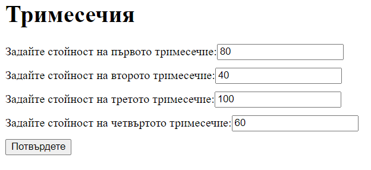
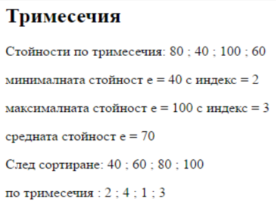

# quarters-php
Да се състави приложение за:
 1.Въвеждане на начални стойности на четири величини, които представляват печалбата на една фирма по тримесечия в една година.
 2.Изчисляване и извеждане на минималната, средната и максималната печалба за годината; да се сортират данните във възходящ ред заедно с номера на тримесечието.

 Примерен изглед за постановката и решението на задачата:

